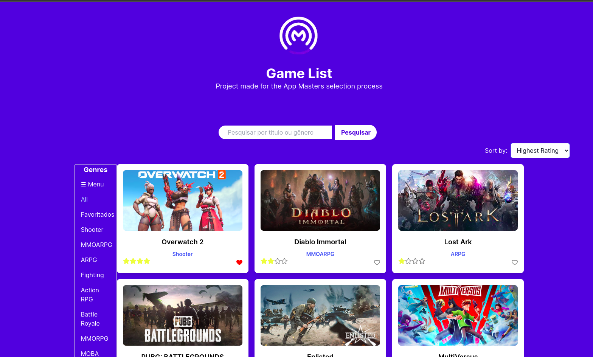
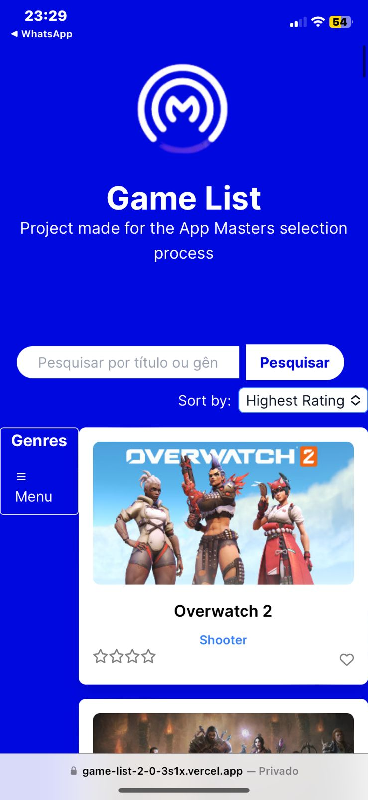
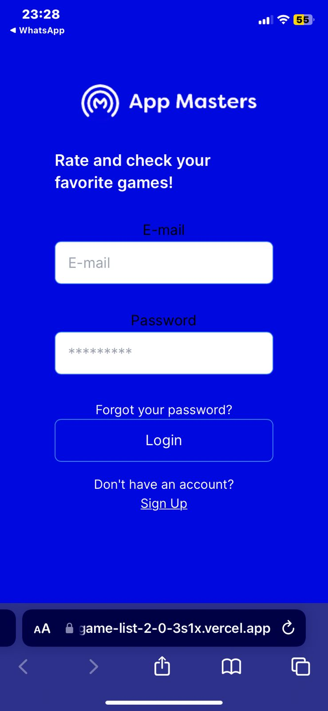

# Projeto de Lista de Jogos

Essa é a fase 2 do projeto que foi desenvolvido como parte do processo seletivo da App Masters. É uma lista de jogos que permite filtrar os jogos por gênero, avaliar jogos, favoritá-los e ordená-los por número de estrelas. O objetivo do projeto é demonstrar habilidades em desenvolvimento web utilizando tecnologias como React.

## Site

Clique [aqui](https://game-list-2-0-3s1x.vercel.app/pages/auth/sign-in) para acessar o site!

## Funcionalidades do Projeto

- Carrega e exibe uma lista de jogos a partir da API fornecida.
- Organiza os jogos em três colunas para uma melhor visualização (no computador).
- Cada card exibe o título e a imagem do jogo.
- Adapta-se de forma responsiva para diferentes dispositivos, incluindo computadores, tablets e celulares.
- Trata erros específicos retornados pela API.
- Inclui um campo de busca para filtrar os jogos por título.
- Permite ao usuário selecionar um gênero entre os disponíveis.
- Filtra os jogos com base no gênero selecionado.
- Permite ao usuário avaliar os jogos de 1 a 4 estrelas.
- Permite ao usuário favoritar os jogos.
- Permite ao usuário ordenar os jogos por número de estrelas em ordem crescente ou decrescente
- Permite ao usuário criar uma conta e autenticar-se usando email e senha
- 
## Tecnologias utilizadas

- Next.js
- Tailwind CSS
- React
- Firestore
- Firebase

## Capturas de Tela
Desktop

Mobile

## Contribuição

Contribuições são bem-vindas! Se você tiver sugestões, melhorias ou correções, sinta-se à vontade para criar uma _issue_ ou enviar um _pull request_.
